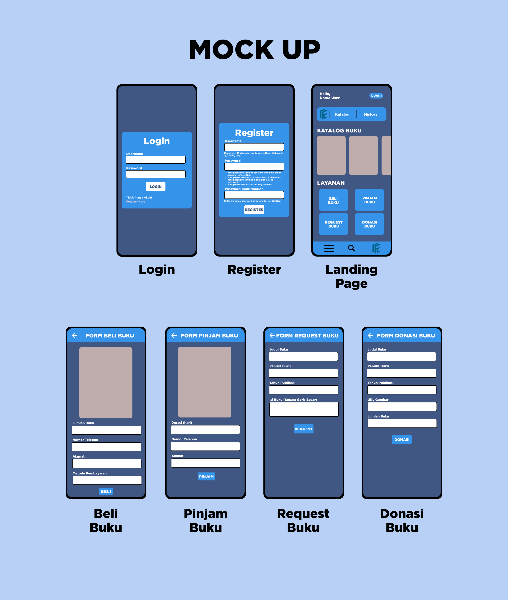
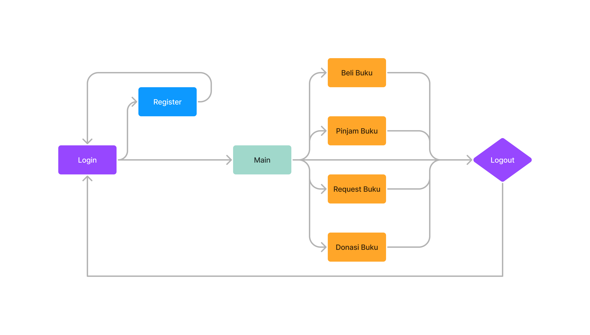
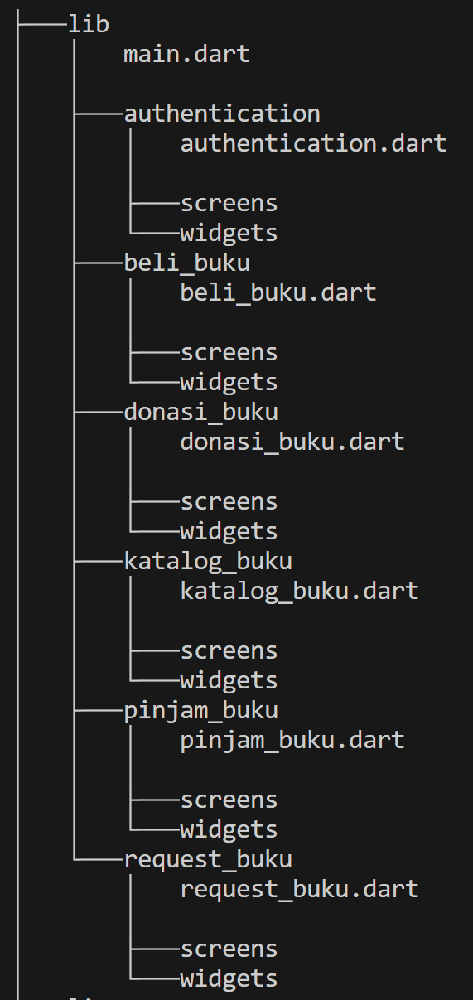

# Proyek Akhir Semester
## Membuat Aplikasi Mobile menggunakan Framework Flutter
## Pemrograman Berbasis Platform

## Nama-nama anggota kelompok
- Ricky Setiawan        (2206083161) 
- Caesar Justitio       (2206082373)
- Devin Faiz Faturahman (2206830593)
- Bimantoro Widyadana   (2206824306)
- Thirza Ahmad Tsaqif   (2206082556)

## Cerita aplikasi yang diajukan serta manfaatnya
Dalam era digital saat ini, tantangan literasi bukan hanya sebatas aksesibilitas buku, tetapi juga bagaimana memotivasi masyarakat untuk terlibat aktif dalam budaya membaca. Sebagai respons terhadap kondisi sosial yang menunjukkan adanya penurunan minat baca, diperkenalkan sebuah inovasi digital bernama `Flex-lib`. Kita memutuskan untuk menggunakan nama `Flex-lib` karena kita membuat sebuah aplikasi literasi yang dapat diakses darimana saja dan kapan saja sehingga sangat fleksibel. Aplikasi web ini merupakan simbol harapan baru bagi pecinta buku dan mereka yang ingin mendalami dunia literasi. `Flex-lib` menawarkan fitur Katalog Buku yang memudahkan pengguna untuk menelusuri koleksi buku berdasarkan berbagai kategori dan preferensi. Bagi mereka yang ingin menambah koleksi pribadi, fitur Beli Buku siap menyajikan pilihan buku baru maupun bekas dengan harga terjangkau. Namun, jika pengguna hanya ingin menikmati buku dalam jangka waktu tertentu, fitur Pinjam Buku memungkinkan mereka untuk meminjam buku tanpa harus mengeluarkan biaya besar. Menyadari betapa berharganya setiap buku dan pentingnya mendistribusikan ilmu kepada yang membutuhkan, `Flex-lib` memfasilitasi fitur Donasi Buku, di mana masyarakat dapat berdonasi atau menerima buku dari donatur lainnya. Selain itu, fitur Request Buku memungkinkan pengguna untuk meminta buku tertentu yang belum ada dalam katalog, menggambarkan bagaimana aplikasi ini berupaya memenuhi kebutuhan literasi setiap individu. Dengan `Flex-lib`, kita bukan hanya menghadirkan buku ke hadapan masyarakat, tetapi juga mengajak masyarakat datang kepada buku, merangkul mereka dalam budaya literasi, dan membangun jembatan pengetahuan yang lebih inklusif dan kolaboratif.

- #### Mock Up Flex-lib
  

- #### Alur dari aplikasi
  

## Daftar modul yang akan diimplementasikan  
| Modul          | Pembuat                                                                                                                                                                      |
|---------------------------------------|---------------------------------------|
| **Katalog Buku:** | Ricky Setiawan                                                                                                                                                                                |
| **Beli Buku:**    | Caesar Justitio                                                                                                                                                                               |                                                                                                                                                                   |
| **Pinjam Buku:**  | Devin Faiz Faturahman                                                                                                                                                                               |                                                                                                            
| **Request Buku & Login:** | Thirza Ahmad Tsaqif                                                                                                                                                                               |
| **Donasi Buku & Register:** | Bimantoro Widyadana                                                                                                                                                                               |

| Modul          |Definisi                                                                                                                                                                      |
|---------------------------------------|---------------------------------------|
| **Katalog Buku:** |  Di halaman katalog buku dapat melihat daftar buku yang ada di Flex-lib. Terdapat detail buku pada card buku seperti nama author, nama buku, dan detail lainnya.                                                                                                                                                                               |
| **Beli Buku:**    | Pada modul Beli Buku (Pengguna perlu login) disini dapat melihat buku yang tersedia untuk dibeli. Card disini tercantum juga harga bukunya.                                                                                                                                                                          |                                                                                                                                                                   |
| **Pinjam Buku:**  |  Dapat melihat daftar buku yang tersedia untuk dipinjam. Card pada buku akan melihat status dari buku yang pernah dipinjam.                                                                                                                                                                          |                                                                                                            
| **Request Buku:** | Pada modul Request Buku dapat melakukan request buku. Pada halaman ini akan melihat nama buku yang direquest, deskripsi buku, tanggal request buku, dan status dari buku yang direquest.                                                                                                                                                                       |
| **Donasi Buku:** | Pada modul Donasi Buku dapat melakukan donasi buku dengan memberikan deskripsi buku yang akan di donasikan.                                                                                                                                                                               |

## Role atau peran pengguna beserta deskripsinya (karena bisa saja lebih dari satu jenis pengguna yang mengakses aplikasi)
- Pengguna Non-Login:
Pengguna non-login adalah mereka yang mengunjungi aplikasi perpustakaan tanpa masuk atau membuat akun. Mereka memiliki akses terbatas hanya untuk melihat katalog buku yang tersedia dalam perpustakaan. Mereka tidak dapat menggunakan fitur-fitur lainnya.

- Pengguna Login:
Pengguna login adalah individu yang telah membuat akun dan masuk ke dalam aplikasi perpustakaan. Mereka memiliki akses penuh ke seluruh fitur-fitur aplikasi, termasuk:
  * Melihat Katalog Buku
  * Membeli Buku
  * Meminjam Buku
  * Merequest Buku
  * Mendonasikan Buku.
  
- Pustakawan:
Pustakawan adalah petugas perpustakaan yang memiliki hak akses penuh ke dalam aplikasi "Flex-lib". Mereka memiliki akses penuh ke seluruh fitur-fitur aplikasi serta memiliki tanggung jawab tambahan, untuk menambahkan buku baru.

## Alur pengintegrasian dengan web service untuk terhubung dengan aplikasi web yang sudah dibuat saat Proyek Tengah Semester

1. Migrasi platform Django yang telah dibuat pada saat Proyek Tengah Semester (PTS) ke _domcloud_.
2. Mengubah data dari model Django ke dalam format JSON
3. Membuat model pada aplikasi Flutter untuk menangani data yang diterima melalui endpoint yang telah dibuat dan berakhir dengan /json/.
4. Menggunakan data yang tersimpan untuk operasi seperti get, post, dan delete dengan menggunakan widget-widget di Flutter.
5. Mengintegrasikan frontend dan backend dengan menggunakan metode asynchronous HTTPS.

Untuk Fitur Katalog Buku:  
- User masuk ke dalam aplikasi yang akan menampilkan halaman Katalog Buku. Lalu di dalam halaman Katalog Buku akan ditampilkan daftar buku yang disediakan oleh "Flex-lib".Katalog Buku ini akan melakukan fetch data dari endpoint `https://flex-lib.domcloud.dev/json/` untuk ditampilkan. Di halaman Katalog Buku juga tersedia tombol login yang akan mengarah ke halaman Login dan di dalam halaman Login juga terdapat tombol yang akan mengarah ke halaman Register. Untuk halaman Login memiliki endpoint `https://flex-lib.domcloud.dev/auth/login/` dan untuk halaman Register memiliki endpoint `https://flex-lib.domcloud.dev/auth/register/`.
Jika user telah melakukan login, akan muncul beberapa tombol yang mengarah ke beberapa modul. Modul tersebut adalah Beli Buku, Pinjam Buku, Request Buku, dan Donasi Buku. Lalu untuk peran pustakawan akan ditambah satu modul yaitu Tambah Buku.

Untuk fitur Beli Buku:
- Pengguna akan mengakses halaman Beli Buku menggunakan tombol dan drawer yang telah disediakan. Proses pengambilan data Beli Buku akan dilakukan melalui endpoint spesifik yang dibuat selama Proyek Tengah Semester (PTS), yaitu `https://flex-lib.domcloud.dev/beli_buku/json/`. Setelah mendapatkan respons dari endpoint ini, isi respons tersebut akan di-decode menjadi instance dari model di aplikasi untuk kemudian diintegrasikan ke dalam widget-widget Flutter.
- Selanjutnya, untuk fungsi pengiriman data (post), akan digunakan endpoint lain yang juga telah dikembangkan selama PTS, yaitu `https://flex-lib.domcloud.dev/beli_buku/create_beli_buku<int:id>`.

Untuk Fitur Pinjam Buku:  
- Pengguna akan mengakses halaman Pinjam Buku menggunakan tombol dan drawer yang telah disediakan. Proses pengambilan data Pinjam Buku akan dilakukan melalui endpoint spesifik yang dibuat selama Proyek Tengah Semester (PTS), yaitu `https://flex-lib.domcloud.dev/pinjam_buku/json/`. Setelah mendapatkan respons dari endpoint ini, isi respons tersebut akan di-decode menjadi instance dari model di aplikasi untuk kemudian diintegrasikan ke dalam widget-widget Flutter.
- Selanjutnya, untuk fungsi pengiriman data (post), akan digunakan endpoint lain yang juga telah dikembangkan selama PTS, yaitu `https://flex-lib.domcloud.dev/pinjam_buku/create_pinjam_buku/<int:id>`.

Untuk Fitur Request Buku:  
- Pengguna akan mengakses halaman Request Buku menggunakan tombol dan drawer yang telah disediakan. Proses pengambilan data Request Buku akan dilakukan melalui endpoint spesifik yang dibuat selama Proyek Tengah Semester (PTS), yaitu `https://flex-lib.domcloud.dev/request_buku/json/`. Setelah mendapatkan respons dari endpoint ini, isi respons tersebut akan di-decode menjadi instance dari model di aplikasi untuk kemudian diintegrasikan ke dalam widget-widget Flutter.
- Selanjutnya, untuk fungsi pengiriman data (post), akan digunakan endpoint lain yang juga telah dikembangkan selama PTS, yaitu `https://flex-lib.domcloud.dev/request_buku/create_request_buku/`.
- Selanjutnya, untuk fungsi penghapusan data (delete), akan digunakan endpoint lain yang juga telah dikembangkan selama PTS, yaitu `https://flex-lib.domcloud.dev/request_buku/delete_request_buku/<int:id>`.

Untuk Fitur Donasi Buku:  
- Pengguna akan mengakses halaman Donasi Buku menggunakan tombol dan drawer yang telah disediakan. Proses pengambilan data Donasi Buku akan dilakukan melalui endpoint spesifik yang dibuat selama Proyek Tengah Semester (PTS), yaitu `https://flex-lib.domcloud.dev/donasi_buku/json/`. Setelah mendapatkan respons dari endpoint ini, isi respons tersebut akan di-decode menjadi instance dari model di aplikasi untuk kemudian diintegrasikan ke dalam widget-widget Flutter.
- Selanjutnya, untuk fungsi pengiriman data (post), akan digunakan endpoint lain yang juga telah dikembangkan selama PTS, yaitu `https://flex-lib.domcloud.dev/donasi_buku/create_donasi_buku/`.
- Selanjutnya, untuk fungsi penghapusan data (delete), akan digunakan endpoint lain yang juga telah dikembangkan selama PTS, yaitu `https://flex-lib.domcloud.dev/donasi_buku/delete_donasi_buku/<int:id>`.

### Struktur Folder

## Tautan Berita Acara
[Berita Acara](https://docs.google.com/spreadsheets/d/1G-1tKHE3ZCuPg560ifwNoP7c5bZUEQPgbGDF1paXKHA/edit?usp=sharing)

## Badge App Center

## Link Distribusi Aplikasi 
[Flex-Lib](https://install.appcenter.ms/orgs/e07/apps/flex-lib-app/distribution_groups/public)